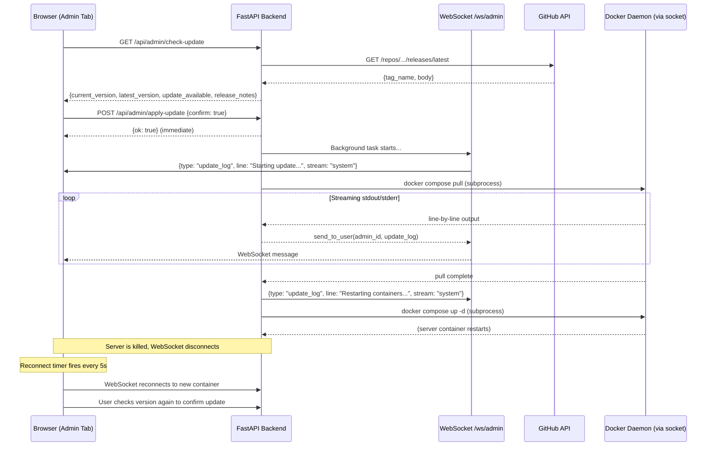
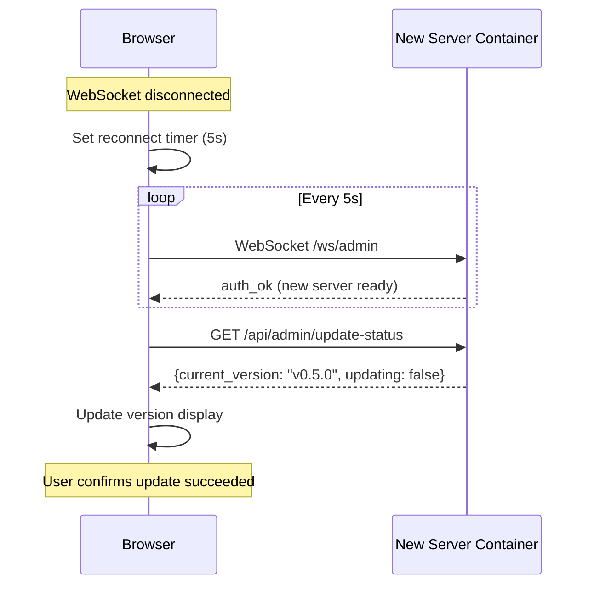

# Admin Update Tab — Implementation Plan

## Overview

Add an **Update** tab to the admin panel that lets the owner (or authorized admins) remotely update the Chronicle Architect application via Docker commands through the mounted Docker socket.

---

## Architecture Flow



---

## File Change Summary

| File | Change Type | Description |
|------|-------------|-------------|
| [`app/routers/admin_router.py`](app/routers/admin_router.py) | Modify | Add 2 new endpoints + settings + helper functions |
| [`static/index.html`](static/index.html) | Modify | Add update tab, WS handler, settings toggle |
| [`docker-compose.yml`](docker-compose.yml) | Modify | Add Docker socket mount |

---

## 1. Backend: [`app/routers/admin_router.py`](app/routers/admin_router.py) Changes

### 1.1 New Imports

Add at the top of the file:

```python
import asyncio
import httpx
from fastapi import BackgroundTasks
```

### 1.2 New Default Settings

Add to [`DEFAULT_CONFIG`](app/routers/admin_router.py:55):

```python
"allow_admins_update": False,
```

### 1.3 Version Comparison Helper

Add before the router endpoints:

```python
def _parse_version(v: str) -> tuple:
    """Parse 'v0.4.2' or '0.4.2' into (0, 4, 2) for comparison."""
    v = v.lstrip("v")
    return tuple(int(p) for p in v.split("."))
```

### 1.4 Update State (module-level globals)

```python
_update_lock = asyncio.Lock()
_updating_in_progress = False
```

### 1.5 `GET /api/admin/check-update` Endpoint

```python
@router.get("/check-update")
async def check_update(
    admin: dict = Depends(get_current_admin_or_owner),
):
    # 1. Read local version.json
    version_path = os.path.join(BASE_DIR, "version.json")
    try:
        with open(version_path, "r") as f:
            local = json.load(f)
    except Exception as e:
        raise HTTPException(status_code=500, detail=f"Failed to read version.json: {e}")

    current_version = local.get("version", "0.0.0")
    if not current_version.startswith("v"):
        current_version = "v" + current_version

    # 2. Fetch latest from GitHub
    try:
        async with httpx.AsyncClient(timeout=15.0) as client:
            resp = await client.get(
                "https://api.github.com/repos/ChronicleArchitect/ChronicleArchitect/releases/latest",
                headers={"Accept": "application/vnd.github.v3+json"},
            )
            if resp.status_code == 403 or resp.status_code == 429:
                raise HTTPException(
                    status_code=502,
                    detail=f"GitHub API rate limited. Please try again later."
                )
            resp.raise_for_status()
            data = resp.json()
    except httpx.TimeoutException:
        raise HTTPException(status_code=502, detail="Timeout contacting GitHub API.")
    except httpx.HTTPError as e:
        raise HTTPException(status_code=502, detail=f"GitHub API error: {e}")

    latest_tag = data.get("tag_name", "")
    latest_version = latest_tag if latest_tag.startswith("v") else "v" + latest_tag
    release_notes = data.get("body", "")

    # 3. Compare versions
    try:
        current_tuple = _parse_version(current_version)
        latest_tuple = _parse_version(latest_version)
        update_available = latest_tuple > current_tuple
    except (ValueError, IndexError):
        update_available = False

    return {
        "current_version": current_version,
        "latest_version": latest_version,
        "update_available": update_available,
        "release_notes": release_notes,
    }
```

### 1.6 `POST /api/admin/apply-update` Endpoint

```python
@router.post("/apply-update")
async def apply_update(
    body: dict,
    background_tasks: BackgroundTasks,
    admin: dict = Depends(get_current_admin_or_owner),
):
    # Permission check
    if admin["role"] != "owner":
        config = _load_config()
        if not config.get("allow_admins_update", False):
            raise HTTPException(
                status_code=status.HTTP_403_FORBIDDEN,
                detail="Only the owner can apply updates."
            )

    # Docker socket check
    if not os.path.exists("/var/run/docker.sock"):
        raise HTTPException(
            status_code=status.HTTP_503_SERVICE_UNAVAILABLE,
            detail="Docker socket not available at /var/run/docker.sock. "
                   "Ensure the container has the socket mounted."
        )

    # Confirmation safety check
    if not body.get("confirm"):
        raise HTTPException(
            status_code=status.HTTP_400_BAD_REQUEST,
            detail="Request body must include 'confirm': true"
        )

    # Lock check
    if _update_lock.locked():
        raise HTTPException(
            status_code=status.HTTP_409_CONFLICT,
            detail="An update is already in progress."
        )

    force = body.get("force", False)

    # Start background task
    background_tasks.add_task(_run_update, admin["id"], force)

    return {"ok": True}
```

### 1.7 `GET /api/admin/update-status` Endpoint (for polling)

```python
@router.get("/update-status")
async def update_status(
    admin: dict = Depends(get_current_admin_or_owner),
):
    version_path = os.path.join(BASE_DIR, "version.json")
    try:
        with open(version_path, "r") as f:
            local = json.load(f)
    except Exception:
        local = {"version": "unknown"}
    return {
        "updating": _updating_in_progress,
        "current_version": local.get("version", "0.0.0"),
    }
```

### 1.8 Streaming Subprocess Helpers + Background Task

```python
async def _stream_output(stream, admin_id: int, stream_name: str):
    """Read lines from a subprocess pipe and send each line to the admin's WebSocket."""
    while True:
        line = await stream.readline()
        if not line:
            break
        text = line.decode(errors="replace").rstrip()
        if text:
            await admin_manager.send_to_user(admin_id, {
                "type": "update_log",
                "line": text,
                "stream": stream_name,
            })


async def _run_update(admin_id: int, force: bool):
    """Background task: pull new Docker image and restart containers."""
    global _updating_in_progress

    async with _update_lock:
        _updating_in_progress = True
        try:
            await admin_manager.send_to_user(admin_id, {
                "type": "update_log",
                "line": "Starting update process...",
                "stream": "system",
            })

            # ── Step 1: docker compose pull ──
            await admin_manager.send_to_user(admin_id, {
                "type": "update_log",
                "line": "Step 1/2: Pulling latest Docker images...",
                "stream": "system",
            })

            proc = await asyncio.create_subprocess_exec(
                "docker", "compose", "pull",
                stdout=asyncio.subprocess.PIPE,
                stderr=asyncio.subprocess.PIPE,
                start_new_session=True,
                cwd="/app",
            )

            await asyncio.gather(
                _stream_output(proc.stdout, admin_id, "stdout"),
                _stream_output(proc.stderr, admin_id, "stderr"),
            )
            await proc.wait()

            if proc.returncode != 0:
                await admin_manager.send_to_user(admin_id, {
                    "type": "update_log",
                    "line": f"docker compose pull failed with exit code {proc.returncode}. Aborting update.",
                    "stream": "system",
                })
                return

            # ── Step 2: docker compose up -d ──
            await admin_manager.send_to_user(admin_id, {
                "type": "update_log",
                "line": "Step 2/2: Recreating containers with new image...",
                "stream": "system",
            })

            proc2 = await asyncio.create_subprocess_exec(
                "docker", "compose", "up", "-d",
                stdout=asyncio.subprocess.PIPE,
                stderr=asyncio.subprocess.PIPE,
                start_new_session=True,
                cwd="/app",
            )

            await asyncio.gather(
                _stream_output(proc2.stdout, admin_id, "stdout"),
                _stream_output(proc2.stderr, admin_id, "stderr"),
            )
            await proc2.wait()

            # Send final message before server gets killed
            await admin_manager.send_to_user(admin_id, {
                "type": "update_log",
                "line": "Update complete. Server restarting...",
                "stream": "system",
            })

            # Brief delay to let the WebSocket message flush before container is killed
            await asyncio.sleep(2)

        except FileNotFoundError:
            await admin_manager.send_to_user(admin_id, {
                "type": "update_log",
                "line": "Error: 'docker' command not found. Is Docker CLI installed in the container?",
                "stream": "system",
            })
        except Exception as e:
            await admin_manager.send_to_user(admin_id, {
                "type": "update_log",
                "line": f"Unexpected error: {type(e).__name__}: {e}",
                "stream": "system",
            })
        finally:
            _updating_in_progress = False
```

### 1.9 Settings Validation Update

In the [`update_settings`](app/routers/admin_router.py:453) endpoint's body handling block, add:

```python
if "allow_admins_update" in body:
    config["allow_admins_update"] = bool(body["allow_admins_update"])
```

Place this alongside the other boolean settings (around line 499).

---

## 2. Frontend: [`static/index.html`](static/index.html) Changes

### 2.1 State Variables (inside `openAdminPanel`)

After the existing state variables (line 3700), add:

```javascript
let updateCheckResult = null;
let updateLogs = [];
let updateChecking = false;
let updateApplying = false;
```

### 2.2 Tab Button in `renderModal`

Add a new Update tab button after the Storage tab button (after line 3964) in the [`renderModal`](static/index.html:3898) function:

```javascript
(getUserRole() === 'owner' || (getUserRole() === 'admin' && settings.allow_admins_update))
    ? el('button', {
        className: 'admin-tab' + (activeTab === 'update' ? ' active' : ''),
        onclick: () => {
            clearAIUsageInterval();
            activeTab = 'update'; renderModal();
        },
    }, 'Update')
    : null,
```

### 2.3 Tab Dispatch in `renderModal`

Update the tab content switch (around line 3900):

```javascript
function renderModal() {
    var tabContent;
    if (activeTab === 'users') tabContent = renderUsersTab();
    else if (activeTab === 'tokens') tabContent = renderTokensTab();
    else if (activeTab === 'logs') tabContent = renderLogsTab();
    else if (activeTab === 'ai') tabContent = renderAITab();
    else if (activeTab === 'storage') tabContent = renderStorageTab();
    else if (activeTab === 'update') tabContent = renderUpdateTab();
    else tabContent = renderSettingsTab();
    // ... rest unchanged
```

### 2.4 `renderUpdateTab()` Function

Add a new function inside `openAdminPanel`:

```javascript
function renderUpdateTab() {
    const isOwner = getUserRole() === 'owner';
    const canUpdate = isOwner || settings.allow_admins_update;

    return el('div', { className: 'admin-update-tab' },
        // Current version display
        el('p', { style: { marginBottom: '8px', fontSize: '14px' } },
            'Current version: ',
            el('strong', null, updateCheckResult ? updateCheckResult.current_version : '...'),
        ),

        // Check for Updates button / loading
        updateChecking
            ? el('p', { style: { color: 'var(--text-muted)', fontSize: '13px' } }, 'Checking for updates...')
            : el('button', {
                className: 'btn btn-secondary btn-sm',
                style: { marginBottom: '12px' },
                onclick: updateCheck,
                disabled: updateApplying ? 'disabled' : null,
            }, 'Check for Updates'),

        // Check result area
        updateCheckResult ? el('div', { style: { marginBottom: '12px' } },
            // Latest version info
            el('p', { style: { fontSize: '14px', marginBottom: '4px' } },
                'Latest version: ',
                el('strong', null, updateCheckResult.latest_version),
                ' \u2014 ',
                updateCheckResult.update_available
                    ? el('span', { style: { color: 'var(--success)' } }, 'Update available')
                    : el('span', { style: { color: 'var(--text-muted)' } }, 'Up to date'),
            ),

            // Update button
            updateCheckResult.update_available && canUpdate
                ? el('button', {
                    className: 'btn btn-primary',
                    style: { marginBottom: '12px' },
                    onclick: updateApply,
                    disabled: updateApplying ? 'disabled' : null,
                }, updateApplying ? 'Update in progress...' : 'Update to ' + updateCheckResult.latest_version)
                : null,

            // Release notes (collapsible)
            updateCheckResult.release_notes
                ? el('details', { style: { marginBottom: '8px', fontSize: '13px' } },
                    el('summary', { style: { cursor: 'pointer', color: 'var(--text-muted)' } }, 'Release Notes'),
                    el('div', {
                        style: {
                            marginTop: '4px',
                            padding: '8px',
                            background: 'var(--bg-secondary)',
                            borderRadius: '4px',
                            whiteSpace: 'pre-wrap',
                            maxHeight: '200px',
                            overflowY: 'auto',
                            fontSize: '12px',
                        },
                    }, updateCheckResult.release_notes),
                )
                : null,
        ) : null,

        // Error handling is done via the existing saveError mechanism
        // or we add updateError state

        // Log panel (always rendered if logs exist)
        updateLogs.length > 0
            ? el('div', { style: { marginTop: '8px' } },
                el('h4', { style: { fontSize: '13px', marginBottom: '4px', color: 'var(--text-muted)' } }, 'Update Log'),
                el('div', {
                    id: 'update-log-panel',
                    style: {
                        maxHeight: '300px',
                        overflowY: 'auto',
                        fontFamily: 'monospace',
                        fontSize: '12px',
                        background: '#1e1e1e',
                        color: '#d4d4d4',
                        padding: '8px',
                        borderRadius: '4px',
                        whiteSpace: 'pre-wrap',
                        wordBreak: 'break-all',
                    },
                }, updateLogs.map(log =>
                    el('div', {
                        style: {
                            color: log.stream === 'stderr' ? '#f48771'
                                : log.stream === 'system' ? '#6a9955'
                                : '#d4d4d4',
                        },
                    }, log.line)
                )),
            )
            : null,
    );
}
```

**Important**: After rendering, auto-scroll the log panel to bottom using a `setTimeout`:

```javascript
setTimeout(() => {
    const panel = document.getElementById('update-log-panel');
    if (panel) panel.scrollTop = panel.scrollHeight;
}, 0);
```

This should be called after `renderModal()` when `updateLogs` has changed. The simplest approach is to call it at the end of `renderModal()` if `activeTab === 'update'`.

### 2.5 `updateCheck()` Function

```javascript
function updateCheck() {
    updateChecking = true;
    updateCheckResult = null;
    renderModal();
    apiGet('/api/admin/check-update')
        .then(data => {
            updateCheckResult = data;
            updateChecking = false;
            renderModal();
        })
        .catch(err => {
            updateChecking = false;
            saveError = err.message;
            renderModal();
        });
}
```

### 2.6 `updateApply()` Function

```javascript
function updateApply() {
    if (!confirm('Are you sure you want to apply the update? The server will restart.')) return;
    updateApplying = true;
    updateLogs = [];
    renderModal();
    apiPost('/api/admin/apply-update', { confirm: true })
        .then(data => {
            // The request returns immediately; streaming happens via WebSocket
            renderModal();
        })
        .catch(err => {
            updateApplying = false;
            saveError = err.message;
            renderModal();
        });
}
```

### 2.7 WebSocket Integration

In the [`connectAdminWS`](static/index.html:7380) function's `onmessage` handler (after the `data_changed` block at line 7413), add:

```javascript
else if (msg.type === 'update_log') {
    if (typeof updateLogs !== 'undefined') {
        updateLogs.push({ line: msg.line, stream: msg.stream });
        // Limit log buffer to prevent memory issues
        if (updateLogs.length > 500) updateLogs.shift();
        renderModal();
        // Auto-scroll is handled after renderModal (see renderModal update)
    }
}
```

Also, in the `adminWS.onclose` handler, consider showing a "Reconnecting..." message in the update tab if an update was in progress:

```javascript
adminWS.onclose = (event) => {
    console.log('[WS Admin] Connection closed — code:', event.code, 'reason:', event.reason || '(none)', 'wasClean:', event.wasClean);
    adminWS = null;
    // If an update was applying, the server likely restarted
    if (updateApplying) {
        updateLogs.push({ line: 'Connection lost — server is restarting. Reconnecting in 5s...', stream: 'system' });
        renderModal();
    }
    // Reconnect after 5s if admin panel is still open
    if (document.querySelector('.admin-modal')) {
        console.log('[WS Admin] Admin panel open — scheduling reconnect in 5s...');
        wsAdminReconnectTimer = setTimeout(connectAdminWS, 5000);
    }
};
```

Also update the `adminWS.onopen` handler to subscribe to an `update` channel (optional, but good practice):

```javascript
adminWS.onopen = () => {
    console.log('[WS Admin] Connected to server, sending auth...');
    adminWS.send(JSON.stringify({ type: 'auth', token: token }));
};
```

The existing subscribe channels after auth_ok (`users`, `logs`, `tokens`) remain unchanged; we don't need a separate channel for update logs since they are pushed directly to the user via `send_to_user`.

### 2.8 Auto-scroll After renderModal

Modify `renderModal()` to auto-scroll the log panel when the update tab is active. At the end of `renderModal()`, after the overlay replacement logic (around line 3980), add:

```javascript
// Auto-scroll update log panel
if (activeTab === 'update' && updateLogs.length > 0) {
    setTimeout(() => {
        const panel = document.getElementById('update-log-panel');
        if (panel) panel.scrollTop = panel.scrollHeight;
    }, 0);
}
```

### 2.9 Settings Tab Toggle

In `renderSettingsTab()`, add a new checkbox toggle for `allow_admins_update`. Insert it alongside the other admin permission toggles (e.g., after the "Allow admins to manage AI" checkbox at line 4522):

```javascript
el('div', { className: 'form-group' },
    el('label', null,
        el('input', {
            id: 'allow-admins-update',
            type: 'checkbox',
            checked: settings.allow_admins_update ? 'checked' : null,
            style: { marginRight: '8px' },
        }),
        'Allow admins to manage updates',
    ),
),
```

In `handleSaveSettings()`, add:

```javascript
const allowAdminsUpdateInput = document.getElementById('allow-admins-update');
// ... along with other inputs
if (allowAdminsUpdateInput) body.allow_admins_update = allowAdminsUpdateInput.checked;
```

---

## 3. Infrastructure: [`docker-compose.yml`](docker-compose.yml) Change

Add the Docker socket volume mount:

```yaml
volumes:
  - /var/run/docker.sock:/var/run/docker.sock
  - ./data:/app/data
```

---

## 4. Edge Cases & Error Handling

### 4.1 Docker Socket Not Mounted
- Backend checks `os.path.exists("/var/run/docker.sock")` before starting update
- Returns **503 Service Unavailable** with clear message
- Frontend shows error via `saveError`

### 4.2 Update Already in Progress
- Backend uses `asyncio.Lock()` (`_update_lock`) to prevent concurrent updates
- Returns **409 Conflict** if another update is running
- Frontend disables buttons while `updateApplying === true`

### 4.3 GitHub API Rate Limiting
- Check-update endpoint catches 403/429 responses
- Returns **502 Bad Gateway** with user-friendly message
- Frontend shows error in saveError banner

### 4.4 Network Timeout
- httpx client configured with 15-second timeout
- Returns **502 Bad Gateway** on timeout
- Frontend shows error message

### 4.5 `docker compose pull` Fails
- Background task checks `proc.returncode`
- Sends error line via WebSocket
- Sets `_updating_in_progress = False`
- Frontend shows error in log panel

### 4.6 `docker` Command Not Found
- `asyncio.create_subprocess_exec` raises `FileNotFoundError`
- Background task catches it and sends error message via WebSocket

### 4.7 Server Restart During Update
- WebSocket disconnects when container is killed
- Frontend auto-reconnect timer (5s) reconnects to new container
- User can check version again to verify update succeeded
- Log panel preserves history across reconnects within same admin panel session

### 4.8 Docker Compose File Not Found
- If `docker compose` can't find the compose file, it outputs an error to stderr
- This is streamed to the frontend via WebSocket

### 4.9 Version Parse Errors
- `_parse_version()` raises ValueError if version string is malformed
- check-update endpoint catches this and sets `update_available: false`
- Returns gracefully without crashing

### 4.10 Memory Leak from Log Buffer
- Frontend limits `updateLogs` array to 500 entries (`shift()` when exceeded)

---

## 5. Reconnection Flow After Server Restart



---

## 6. Testing Checklist

1. **Check update with no internet**: Backend returns 502, frontend shows error
2. **Check update when already latest**: `update_available: false`, button disabled
3. **Apply update with missing Docker socket**: 503 error displayed in frontend
4. **Apply update without confirm**: 400 error
5. **Apply update as non-owner admin (setting off)**: 403 error
6. **Apply update as non-owner admin (setting on)**: Update proceeds
7. **Concurrent update attempt**: Second request returns 409
8. **Update in progress**: All buttons disabled, log panel streaming
9. **Server restart**: WebSocket reconnects, user can verify new version
10. **Settings persistence**: `allow_admins_update` saved and loaded correctly
