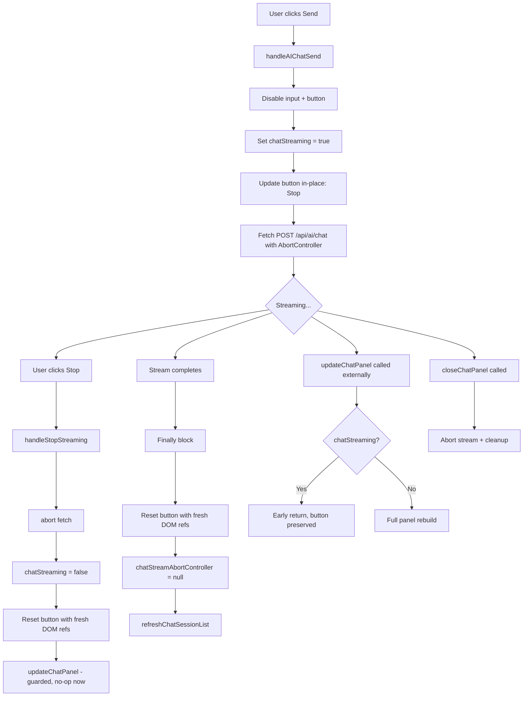

# Design: AI Chat Reasoning Toggle + Stop Button Fix

## Problem Summary

Two broken features in the AI Chat panel:

1. **Reasoning Toggle** — When the user toggles reasoning OFF, the backend still sends no parameters to tell the upstream API to disable reasoning. Each API model family uses different parameter conventions (e.g., `thinking: { type: "disabled" }` for DeepSeek, `extra_body: { reasoning: false }` for MiMo/Kimi).

2. **Stop Button** — The Send button fails to reliably become a Stop button during streaming. The button update happens in-place in `handleAIChatSend()` but is vulnerable to stale DOM references, early JS errors, and `updateChatPanel()` being called during streaming (which rebuilds the input area and replaces the button with a vanilla "Send" button).

---

## Part 1 — Reasoning Toggle: Per-Model Parameter Mapping

### 1.1 Mapping Design

We introduce a `REASONING_MAP` constant dict in `app/routers/ai_router.py` that maps model-name patterns to their upstream API parameters. The dict keys are **regex patterns** applied against `model_name`; values define what to add to the upstream JSON body for both enabled and disabled states.

```python
# --- Reasoning/Thinking parameter map ---
# Keys are regex patterns matched against model_name (case-insensitive).
# `enable` / `disable` objects are merged into the upstream POST json body.
# `extra_body_wrap` indicates that the params should be nested under `extra_body`
#   (used by MiMo, Kimi, etc. that follow OpenAI's `extra_body` convention).
REASONING_MAP = [
    {
        "pattern": r"^(deepseek|glm)",
        "enable": {"thinking": {"type": "enabled"}},
        "disable": {"thinking": {"type": "disabled"}},
    },
    {
        "pattern": r"^(mimo|kimi)",
        "extra_body_wrap": True,
        "enable": {"reasoning": True},
        "disable": {"reasoning": False},
    },
    {
        "pattern": r"^o1|^o3|^o4",
        "enable": {"reasoning_effort": "medium"},
        "disable": {},  # O-series does not support disabling; omit param entirely
    },
]
```

**Design rationale:**

- A list of dicts (ordered) is chosen over a single flat dict so that multiple patterns can match. First match wins.
- `extra_body_wrap: True` means the params are placed under an `extra_body` key (OpenAI's convention for provider-specific params). DeepSeek/GLM put `thinking` at the top level.
- For O-series models, disabling is not supported; we simply omit the param and let the backend's existing `reasoning_content` stripping handle it.

### 1.2 Application at Request Time

In the `sse_generator()` function (currently line 1748), before the `client.stream()` call:

```python
# Determine reasoning/thinking parameters for the upstream API
reasoning_params = {}
extra_body_params = {}
for entry in REASONING_MAP:
    if re.search(entry["pattern"], model_name, re.IGNORECASE):
        params = entry["enable"] if body.reasoning else entry["disable"]
        if entry.get("extra_body_wrap"):
            extra_body_params = params
        else:
            reasoning_params = params
        break

# Build the json payload
request_json = {
    "model": model_name,
    "messages": upstream_messages,
    "stream": True,
}
if reasoning_params:
    request_json.update(reasoning_params)
if extra_body_params:
    request_json["extra_body"] = extra_body_params
```

### 1.3 Safety Backstop (existing, keep as-is)

Regardless of what the upstream API receives, the backend **already strips** `reasoning_content` from delta chunks when `body.reasoning` is false (lines 1798-1803). This serves as a safety net for APIs that ignore the disable parameter.

### 1.4 Models That Don't Support Thinking

If a model doesn't match any entry in `REASONING_MAP`, no extra params are sent. The safety backstop (stripping `reasoning_content`) still applies when `reasoning=False`. This is the correct safe default.

### 1.5 Changes to `AIChatRequest` Model

No changes needed — the `reasoning: Optional[bool] = False` field already exists and is properly sent by the frontend.

### 1.6 Edge Cases

| Scenario | Behavior |
|----------|----------|
| `reasoning=true` but model doesn't support it | No extra params sent; upstream ignores. Frontend may receive `reasoning_content` which it shows correctly. |
| `reasoning=false` but model doesn't support it | No extra params sent; safety backstop strips `reasoning_content` from stream. |
| Model matches multiple patterns | First match wins (list ordering). |
| Empty `model_name` | No match, safe defaults used. |

---

## Part 2 — Stop Button Reliability

### 2.1 Root Cause Analysis

The stop button fails because:

1. **Stale DOM reference**: `sendBtn` is captured at line 10019, before streaming starts. If `updateChatPanel()` is called by any other code path (e.g., `loadChatSessions()` resolving), it replaces the entire panel DOM including the send button, and the old `sendBtn` variable points to a detached element.

2. **JS error before line 10034**: If an error occurs in lines 10029-10033 (e.g., `renderChatMessageBubble` throws), the `sendBtn` update at line 10034 never runs, leaving the button disabled + with text "Send".

3. **`updateChatPanel()` during streaming**: `refreshChatSessionList()` at line 10243 (in `finally` block) calls `apiGet`, which is fine. But other code paths — like the reasoning checkbox `onchange` at line 9653, or session selector `onchange` at line 9637 — call `updateChatPanel()` which re-renders the input area using `chatStreaming` state. At line 9764, if `chatStreaming` is `true`, it creates a **new** stop button with a proper abort handler. However:
   - The timing window: if `updateChatPanel()` is called by an async callback that resolves mid-stream, the panel re-render could reset the button.
   - More critically: if the session list loading completes mid-stream (line 9840-9848 in `loadChatSessions`), it will **auto-select** a session (line 9843-9845), which calls `loadChatSession`, which calls `updateChatPanel()` (line 9891), which rebuilds the entire panel and replaces the stop button.

### 2.2 Solution: Guard Against Mid-Stream Panel Rebuild

**Principle**: The `renderAIChatTab()` function (line 9627) already checks `chatStreaming` to decide whether to render a Stop or Send button. The key fix is to **prevent `updateChatPanel()` from being called during streaming**.

#### Change 2a — Guard `updateChatPanel()` with streaming check

In `updateChatPanel()` (line 9586), add an early return if streaming is active:

```javascript
function updateChatPanel() {
    // CRITICAL: Do NOT rebuild the panel during AI streaming — it would destroy
    // the stop button and break abort functionality.
    if (chatStreaming && chatActiveTab === 'ai') return;
    const container = document.getElementById('chat-panel-container');
    // ... rest of existing code
}
```

This prevents any call path from destroying the stop button during streaming.

#### Change 2b — Never auto-select session mid-stream

In `loadChatSessions()` (line 9838), check `chatStreaming` before auto-selecting:

```javascript
function loadChatSessions() {
    apiGet('/api/ai/sessions')
        .then(data => {
            chatSessions = data.sessions || data;
            // Auto-select most recent session if none is active
            // BUT NOT if we are currently streaming!
            if (!chatCurrentSessionId && chatSessions.length > 0 && !chatStreaming) {
                chatCurrentSessionId = chatSessions[0].id;
                loadChatSession(chatSessions[0].id);
                return;
            }
            if (!chatStreaming) updateChatPanel();
        })
        // ...
}
```

#### Change 2c — In `handleAIChatSend()`, use fresh DOM references for onclick

The inline `sendBtn.onclick` assigned at line 10038 captures `sendBtn` in a closure. Instead, the onclick should always re-query the DOM:

```javascript
sendBtn.onclick = () => handleStopStreaming();
```

Where `handleStopStreaming` is a new reusable function:

```javascript
function handleStopStreaming() {
    if (chatStreamAbortController) {
        chatStreamAbortController.abort();
        chatStreaming = false;
        chatStatus = 'stopped';
        const lastMsg = chatMessages[chatMessages.length - 1];
        if (lastMsg && lastMsg.role === 'assistant' && !lastMsg.content) {
            chatMessages.pop();
        }
        // Always use fresh DOM references
        const freshInput = document.getElementById('chat-input-field');
        const freshBtn = document.getElementById('chat-send-btn');
        if (freshInput) freshInput.disabled = false;
        if (freshBtn) {
            freshBtn.disabled = false;
            freshBtn.textContent = 'Send';
            freshBtn.className = 'chat-send-btn';
            freshBtn.style.cssText = '';
            freshBtn.onclick = () => handleChatSend();
        }
        updateChatPanel();
    }
}
```

This function is also used in the `renderAIChatTab()` inline handler.

#### Change 2d — Ensure `finally` block uses fresh references (already done)

The existing `finally` block at lines 10227-10256 already queries fresh DOM references (`finalInputField`, `finalSendBtn`) — this is correct and should remain.

#### Change 2e — Remove premature `disabled = true` on sendBtn

Line 10027: `sendBtn.disabled = true;` disables the send button before the code tries to update it to show "Stop". This creates a brief window where the button is disabled but still shows "Send". The stop button's `disabled = false` at line 10060 restores it.

**Recommendation**: Keep line 10027 as-is (it prevents double-clicks during the async setup). The `disabled = false` at line 10060 properly re-enables it once the Stop button is in place.

### 2.3 Summary of Frontend Changes

| File | Line(s) | Change |
|------|---------|--------|
| `static/index.html` | ~9586 | Add `if (chatStreaming && chatActiveTab === 'ai') return;` guard at top of `updateChatPanel()` |
| `static/index.html` | ~9843 | Add `&& !chatStreaming` to auto-select condition |
| `static/index.html` | ~9848 | Add `if (!chatStreaming) updateChatPanel();` guard |
| `static/index.html` | ~10038 | Change inline onclick to call `handleStopStreaming()` |
| `static/index.html` | ~10017 | Add new `handleStopStreaming()` function |
| `static/index.html` | ~9765 | Update inline stop onclick to call `handleStopStreaming()` |

---

## Part 3 — Cleanup and Edge Cases

### 3.1 User Navigates Away During Streaming

If the user closes the chat panel (`closeChatPanel()` at line 9546) or navigates to another part of the app while streaming:

- The `chatStreamAbortController` is still stored in the module-level variable.
- If the user later reopens the chat panel, `chatStreaming` is still `true`, so `updateChatPanel()` (now guarded) won't re-render, and the stop button from the old DOM is gone.
- **Fix**: Ensure `closeChatPanel()` (or a route-change handler) aborts any active stream:

```javascript
function closeChatPanel() {
    chatPanelExpanded = false;
    if (chatStreamAbortController) {
        chatStreamAbortController.abort();
        chatStreamAbortController = null;
        chatStreaming = false;
        chatStatus = 'ready';
    }
    // ... existing cleanup
}
```

### 3.2 WebSocket Disconnects During Streaming

The WS is used for DM/Group/Global chat (not AI chat). AI chat uses SSE over HTTP. WS disconnect does not affect AI streaming. However, the polling timers (`dmPollTimer`, `groupPollTimer`, `globalPollTimer`) should not trigger panel rebuilds during AI streaming. The `updateChatPanel()` guard (Change 2a) protects against this.

### 3.3 Abort Controller Stored Outside Function Scope

The `chatStreamAbortController` is already a module-level variable (line 7922), not local to `handleAIChatSend()`. This is correct — it allows the stop button handler and other cleanup paths to access it.

**Recommendation**: Add a null-check helper to avoid stale references:

```javascript
// In handleStopStreaming, after abort():
chatStreamAbortController = null;  // Already done at line 10230
```

The existing `finally` block already nulls it out at line 10230. The inline stop handler (line 9765-9780) does NOT null it — fix:

```javascript
// In renderAIChatTab's inline stop handler (line 9768 area):
if (chatStreamAbortController) {
    chatStreamAbortController.abort();
    chatStreaming = false;
    chatStatus = 'stopped';
    chatStreamAbortController = null;  // ADD THIS
    // ...
}
```

### 3.4 Multiple Rapid Clicks on Stop

If the user clicks Stop multiple times, the first click calls `abort()` and sets `chatStreaming = false`. Subsequent clicks find `chatStreamAbortController` is null (or `chatStreaming` is false) and are no-ops. This is safe.

### 3.5 Error During Abort

`abort()` can throw if the request has already completed. The `handleStopStreaming()` function should wrap in try-catch:

```javascript
function handleStopStreaming() {
    if (!chatStreamAbortController) return;
    try {
        chatStreamAbortController.abort();
    } catch (_) { /* already completed */ }
    chatStreaming = false;
    chatStatus = 'stopped';
    chatStreamAbortController = null;
    // ... reset UI with fresh DOM references
}
```

---

## Part 4 — Specific Code Changes

### 4.1 Backend: `app/routers/ai_router.py`

**Add import** (at top):

```python
import re
```

**Add REASONING_MAP** (after the `_strip_html` helper, around line 50):

```python
# --- Reasoning/Thinking parameter map ---
# List of pattern entries; first match wins against model_name (case-insensitive).
# 'enable' / 'disable' dicts are merged into the upstream POST JSON body.
# 'extra_body_wrap': True nests params under 'extra_body' key (OpenAI convention).
REASONING_MAP = [
    {
        "pattern": r"^(deepseek|glm)",
        "enable": {"thinking": {"type": "enabled"}},
        "disable": {"thinking": {"type": "disabled"}},
    },
    {
        "pattern": r"^(mimo|kimi)",
        "extra_body_wrap": True,
        "enable": {"reasoning": True},
        "disable": {"reasoning": False},
    },
    {
        "pattern": r"^o1|^o3|^o4",
        "enable": {"reasoning_effort": "medium"},
        "disable": {},
    },
]
```

**Modify `sse_generator()`** (around line 1754, before `client.stream()`):

```python
# Build reasoning/thinking params for upstream API
reasoning_params = {}
extra_body_params = {}
for entry in REASONING_MAP:
    if re.search(entry["pattern"], model_name, re.IGNORECASE):
        params = entry["enable"] if body.reasoning else entry["disable"]
        if entry.get("extra_body_wrap"):
            extra_body_params = params
        else:
            reasoning_params = params
        break

# Build JSON payload for upstream
request_json = {
    "model": model_name,
    "messages": upstream_messages,
    "stream": True,
}
if reasoning_params:
    request_json.update(reasoning_params)
if extra_body_params:
    request_json["extra_body"] = extra_body_params

# Then use request_json in client.stream():
async with client.stream(
    "POST",
    chat_url,
    headers={...},
    json=request_json,  # was previously a literal dict
) as response:
```

### 4.2 Frontend: `static/index.html`

**(A)** Add `handleStopStreaming()` function before `handleAIChatSend()` (around line 10016):

```javascript
// --- AI Chat Stream Abort (used by both inline and in-place stop buttons) ---

function handleStopStreaming() {
    if (!chatStreamAbortController) return;
    try {
        chatStreamAbortController.abort();
    } catch (_) {}
    chatStreaming = false;
    chatStatus = 'stopped';
    chatStreamAbortController = null;
    const lastMsg = chatMessages[chatMessages.length - 1];
    if (lastMsg && lastMsg.role === 'assistant' && !lastMsg.content) {
        chatMessages.pop();
    }
    // Always use fresh DOM references
    const inputField = document.getElementById('chat-input-field');
    const sendBtn = document.getElementById('chat-send-btn');
    if (inputField) inputField.disabled = false;
    if (sendBtn) {
        sendBtn.disabled = false;
        sendBtn.textContent = 'Send';
        sendBtn.className = 'chat-send-btn';
        sendBtn.style.cssText = '';
        sendBtn.onclick = () => handleChatSend();
    }
    updateChatPanel();
}
```

**(B)** In `updateChatPanel()`, add the streaming guard at the top:

```javascript
function updateChatPanel() {
    // CRITICAL: Never rebuild the panel during AI streaming — it destroys
    // the stop button and may break active abort controllers.
    if (chatStreaming && chatActiveTab === 'ai') return;
    const container = document.getElementById('chat-panel-container');
    // ... rest unchanged
}
```

**(C)** In `loadChatSessions()`, guard auto-select and panel update:

```javascript
function loadChatSessions() {
    apiGet('/api/ai/sessions')
        .then(data => {
            chatSessions = data.sessions || data;
            if (!chatCurrentSessionId && chatSessions.length > 0 && !chatStreaming) {
                chatCurrentSessionId = chatSessions[0].id;
                loadChatSession(chatSessions[0].id);
                return;
            }
            if (!chatStreaming) updateChatPanel();
        })
        // ...
}
```

**(D)** In `handleAIChatSend()`, replace the inline onclick:

```javascript
// Lines 10034-10061 should become:
if (sendBtn) {
    sendBtn.textContent = '\u23F9 Stop';
    sendBtn.className = 'chat-send-btn stop';
    sendBtn.style.cssText = 'background:var(--error);color:#fff';
    sendBtn.onclick = handleStopStreaming;  // not inline arrow function
    sendBtn.disabled = false;
}
```

**(E)** In `renderAIChatTab()` (around line 9765), update the inline stop onclick:

```javascript
// Line 9765 change:
chatStreaming
    ? el('button', { className: 'chat-send-btn stop', id: 'chat-send-btn', style: { background: 'var(--error)', color: '#fff' }, onclick: handleStopStreaming }, '\u23F9 Stop')
    : el('button', { className: 'chat-send-btn', id: 'chat-send-btn', onclick: () => handleChatSend() }, 'Send'),
```

**(F)** In `closeChatPanel()`, abort any active stream:

```javascript
function closeChatPanel() {
    chatPanelExpanded = false;
    if (chatStreamAbortController) {
        try { chatStreamAbortController.abort(); } catch (_) {}
        chatStreamAbortController = null;
        chatStreaming = false;
        chatStatus = 'ready';
    }
    // ... existing cleanup (WS, timers, etc.)
}
```

---

## 4.3 Mermaid Diagram: Stop Button Flow



---

## 5. Implementation Order

1. Backend: Add `re` import + `REASONING_MAP` + modify `sse_generator()` to use the mapped parameters
2. Frontend: Add `handleStopStreaming()` function
3. Frontend: Add streaming guard to `updateChatPanel()`
4. Frontend: Update `handleAIChatSend()` to use `handleStopStreaming`
5. Frontend: Update `renderAIChatTab()` stop button to use `handleStopStreaming`
6. Frontend: Guard `loadChatSessions()` during streaming
7. Frontend: Add stream abort in `closeChatPanel()`
