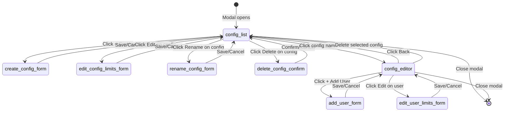

# Hierarchical Configuration-First Workflow — Architectural Plan

## Overview

Restructure the `showAdminEndpointDetail` modal from three parallel tabs (Models | Users | Configurations) into a **two-level hierarchical workflow** where Configurations are the primary organizational layer. Models and Users become child views scoped to the selected Configuration.

---

## 1. State Machine

### States

| State | Description | UI Visible |
|---|---|---|
| `config_list` | Primary view: list of named configs | Config list + header bar |
| `config_editor` | Secondary view: editing a selected config | Back button + Models tab + Users tab |
| `create_config_form` | Modal overlay: create new config | Config list underneath |
| `rename_config_form` | Modal overlay: rename config | Config list underneath |
| `edit_config_limits_form` | Modal overlay: edit config limits | Config list underneath |
| `delete_config_confirm` | Modal overlay: confirm delete | Config list underneath |
| `add_user_form` | Modal overlay: add user to endpoint | Config editor underneath |
| `edit_user_limits_form` | Modal overlay: edit user limits | Config editor underneath |

### State Transitions

```
                   +---> [create_config_form] --save--> [config_list: reload]
                   |
[modal opens] ----> [config_list] --click config-------> [config_editor]
                                      --back/close------> [modal closes]
                                      --delete config----> [delete_config_confirm] --confirm--> [config_list: reload]
                                      --rename config----> [rename_config_form] --save--> [config_list: reload]
                                      --edit limits------> [edit_config_limits_form] --save--> [config_list: reload]
                                      --+ Create Config--> [create_config_form]

[config_editor] --back button-----------> [config_list]
                --delete current config--> [delete_config_confirm] --confirm--> [config_list: reload] (or empty state)
                --close modal------------> [modal closes]
                --+ Add User-------------> [add_user_form] --save--> [config_editor: reload users]
                --edit user limits-------> [edit_user_limits_form] --save--> [config_editor: reload users]
                --(models tab)----------- [config_editor: models sub-tab]
                --(users tab)-----------  [config_editor: users sub-tab]
```

### Transition Logic Table

| Trigger | From | To | Actions |
|---|---|---|---|
| Modal opens | - | `config_list` | Load configs for endpoint |
| User clicks config name | `config_list` | `config_editor` | Set `selectedConfigId`, load models+users for that config context |
| User clicks Back | `config_editor` | `config_list` | Clear `selectedConfigId`, preserve config list state |
| User closes modal | Any | - | Clear all state, close modal overlay |
| User creates config | `config_list` | `create_config_form` | Show create form as overlay |
| Create form saves | `create_config_form` | `config_list` | POST to create, reload config list |
| User renames config | `config_list` | `rename_config_form` | Show rename form as overlay |
| Rename form saves | `rename_config_form` | `config_list` | PUT to rename, reload config list |
| User edits config limits | `config_list` | `edit_config_limits_form` | Show edit form as overlay |
| Edit form saves | `edit_config_limits_form` | `config_list` | PUT to update, reload config list |
| User deletes config | `config_list` | `delete_config_confirm` | Show confirm dialog |
| Delete confirmed | `delete_config_confirm` | `config_list` | DELETE config. If deleted config was selected, clear selection |
| User adds user | `config_editor` | `add_user_form` | Show add user overlay |
| Add user saves | `add_user_form` | `config_editor` | POST to assign user, reload users tab |
| User edits user limits | `config_editor` | `edit_user_limits_form` | Show edit limits overlay |
| Edit limits saves | `edit_user_limits_form` | `config_editor` | PUT to update user, reload users tab |
| User toggles model | `config_editor` | `config_editor` | PUT model update, reload models (in-place) |
| User changes model multiplier | `config_editor` | `config_editor` | PUT model update (debounced) |
| User deletes currently-selected config | `config_editor` (via back) or `config_list` | `config_list` | Clear `selectedConfigId`, show updated list |

---

## 2. DOM Structure

### Modal Layout (two levels)

```
[Modal Container: .modal.manage-modal]
|
+-- [Header]
|   +-- [Title: ep.name]
|   +-- [Subtitle: ep.base_url]
|   +-- [Close button: X]
|
+-- [Primary View: config_list]  (when state === 'config_list')
|   |
|   +-- [Toolbar: "+ Create Configuration" button]
|   |
|   +-- [Config List Container]
|       |
|       +-- (empty state when configs.length === 0)
|       |   "No configurations yet. Create one to get started."
|       |   [Create Configuration button (prominent)]
|       |
|       +-- [Config Card]* (one per config)
|           +-- [Config Name] (clickable -> navigates to config_editor)
|           +-- [Limits Summary] (limit_type, reset_schedule, req/tok limits, shared pool)
|           +-- [Action buttons]
|               +-- [Edit Limits]
|               +-- [Rename]
|               +-- [Delete]
|
+-- [Secondary View: config_editor]  (when state === 'config_editor')
    |
    +-- [Breadcrumb / Back]
    |   +-- [Back button: "< Back to Configurations"]
    |   +-- [Current config name: bold]
    |
    +-- [Tab bar: Models | Users]
    |   (both tabs are scoped to the selected configuration)
    |
    +-- [Tab Content]
        |
        +-- [Models Tab] (when detailTab === 'models')
        |   +-- [Toolbar: "Fetch Models from Endpoint" button]
        |   +-- [Model List] (scoped to config)
        |       +-- [Model row]* 
        |           +-- model_name
        |           +-- Enabled toggle
        |           +-- Request multiplier input
        |           +-- Token multiplier input
        |           +-- Max context input
        |
        +-- [Users Tab] (when detailTab === 'users')
            +-- [Toolbar: "+ Add User" button]
            +-- [User List] (scoped to config)
                +-- [User row]*
                    +-- display_name / username
                    +-- limit_type + reset_schedule summary
                    +-- [Edit] button
                    +-- [Remove] button
```

### CSS Classes for the Two-Level Layout

```css
.config-list-item {
  /* Card-like item with hover, cursor pointer, border */
}
.config-list-item:hover {
  /* Highlight on hover, indicate clickability */
}
.config-editor-back {
  /* Back navigation bar at top of editor view */
}
```

---

## 3. State Management Strategy

### State Variables (in closure of `showAdminEndpointDetail`)

```javascript
// Existing state (preserved)
let detailTab = 'models';           // 'models' | 'users' (no longer 'configs')
let detailModels = [];               // Models cache (grows to include config_id)
let detailUsers = [];                // Users cache (grows to include config_id)
let detailLoading = false;
let detailError = '';
let detailFetching = false;

// New / modified state
let detailConfigs = [];              // Config list (same storage as before)
let detailConfigsLoading = false;
let detailConfigsError = '';
let detailViewState = 'config_list'; // 'config_list' | 'config_editor'
let selectedConfig = null;           // The currently selected config object (or null)
let configModels = [];               // Models loaded for the selected config
let configUsers = [];                // Users loaded for the selected config
let configModelsLoading = false;
let configUsersLoading = false;
let configModelsError = '';
let configUsersError = '';
let unsavedChanges = false;          // Track if user has made changes
```

### State Preservation Rules

1. **When navigating from `config_list` to `config_editor`**:
   - `detailConfigs` is preserved (no reload needed on Back)
   - `selectedConfig` is set to the clicked config object
   - `configModels` and `configUsers` are loaded fresh via API
   - `detailTab` defaults to `'models'`

2. **When navigating Back from `config_editor` to `config_list`**:
   - `selectedConfig` is set to null
   - `configModels`, `configUsers` are cleared
   - `detailConfigs` is NOT reloaded (preserves list state)
   - If `unsavedChanges` is true, show a confirmation dialog

3. **When closing the modal**:
   - All state variables are reset to defaults (closure naturally cleans up)
   - No persistent state needed

4. **When a config is deleted**:
   - If it was the `selectedConfig`, clear `selectedConfig` and `selectedConfigId`
   - Reload `detailConfigs` via API
   - Switch view to `config_list`

5. **When a config is created/renamed/updated**:
   - Reload `detailConfigs` via API
   - Keep current view (`config_list`)

### Unsaved Changes Detection

```javascript
let unsavedChanges = false;

// Set to true when:
// - A model toggle is changed (before API call)
// - A model multiplier input is changed (before API call)
// - A user is added/removed (before API call)
// - User limits are edited (before API call)

// Check when:
// - User clicks Back from config_editor -> config_list
// - User closes the modal while in config_editor
```

---

## 4. API Integration Map

### Current API Calls (all preserved)

| Operation | Current API Call | New Context | When Called |
|---|---|---|---|
| List configs | `GET /api/ai/admin/endpoints/{ep}/configs` | Same (endpoint-level) | On entering `config_list` |
| Create config | `POST /api/ai/admin/endpoints/{ep}/configs` | Same | Create form submit |
| Update config | `PUT /api/ai/admin/endpoints/{ep}/configs/{cfg}` | Same | Edit/Rename form submit |
| Delete config | `DELETE /api/ai/admin/endpoints/{ep}/configs/{cfg}` | Same | Delete confirmation |
| List models | `GET /api/ai/admin/endpoints/{ep}/models` | Same (endpoint-level) | On entering `config_editor` models tab |
| Update model | `PUT /api/ai/admin/endpoints/{ep}/models/{model}` | Same | Toggle/change model |
| List users | `GET /api/ai/admin/endpoints/{ep}/users` | Same (endpoint-level) | On entering `config_editor` users tab |
| Assign user | `POST /api/ai/admin/endpoints/{ep}/users` | Same | Add user form submit |
| Update user | `PUT /api/ai/admin/endpoints/{ep}/users/{user}` | Same | Edit user limits submit |
| Remove user | `DELETE /api/ai/admin/endpoints/{ep}/users/{user}` | Same | Remove user button |
| Fetch models | `POST /api/ai/admin/endpoints/{ep}/fetch-models` | Same (endpoint-level) | Fetch models button |

### Key Insight: No Backend Changes Required

All API calls remain **identical** to the current implementation. The restructuring is purely a **frontend reorganization**:

- Models are still loaded at the **endpoint level** (they are global to the endpoint, not config-specific)
- Users are still loaded at the **endpoint level** (they are assigned to the endpoint, not to a specific config)
- The selected configuration simply provides the **context for displaying and editing** these entities
- The config record's limit settings are displayed as part of the config, not as separate fields in Models/Users

### API Call Summary Table

```
Endpoint-level APIs (no change needed):
  GET    /api/ai/admin/endpoints/{ep_id}/configs
  POST   /api/ai/admin/endpoints/{ep_id}/configs
  PUT    /api/ai/admin/endpoints/{ep_id}/configs/{cfg_id}
  DELETE /api/ai/admin/endpoints/{ep_id}/configs/{cfg_id}
  GET    /api/ai/admin/endpoints/{ep_id}/models
  PUT    /api/ai/admin/endpoints/{ep_id}/models/{model_name}
  GET    /api/ai/admin/endpoints/{ep_id}/users
  POST   /api/ai/admin/endpoints/{ep_id}/users
  PUT    /api/ai/admin/endpoints/{ep_id}/users/{user_id}
  DELETE /api/ai/admin/endpoints/{ep_id}/users/{user_id}
  POST   /api/ai/admin/endpoints/{ep_id}/fetch-models
```

---

## 5. Edge Case Handling

### 5.1 No Configurations Exist (Empty State)

- **Trigger**: `detailConfigs` is an empty array after loading
- **UI**: Show prominent empty-state message:
  - "No configurations yet. Create one to organize model and user settings."
  - Large "+ Create Configuration" call-to-action button
- **Behavior**: `config_list` view with no items, only the create button works

### 5.2 User Makes Changes, Then Navigates Away Without Saving

- **Trigger**: User toggles a model or modifies a multiplier in `config_editor`, then clicks Back
- **Action**: Show confirmation dialog: "You have unsaved changes. Discard them?"
- **Options**:
  - "Stay" -> stay in `config_editor`
  - "Discard" -> navigate to `config_list` (models reload fresh on next entry)
- **Note**: Model changes via `onchange` are saved immediately (PUT on change), so this applies primarily to in-flight edits (e.g., user is still typing a multiplier value)

### 5.3 User Deletes the Currently Selected Configuration

- **Trigger**: User clicks Delete on the config currently open in `config_editor`, OR user is in `config_editor` and deletes via Back + list delete
- **Action**:
  1. Show confirmation dialog: "Delete configuration '[name]'? This will not affect models or user assignments."
  2. On confirm: `DELETE /api/ai/admin/endpoints/{ep}/configs/{cfg_id}`
  3. Set `selectedConfig = null`
  4. Reload config list
  5. Switch to `config_list` view
  6. If this was the only config, show empty state

### 5.4 Multiple Configurations — Selection State Management

- Configs are displayed as a flat list in `config_list`
- Clicking any config name navigates to `config_editor` with that config as `selectedConfig`
- Only one config can be selected at a time
- `selectedConfig` stores the full config object (not just ID) for quick display of config name/limits in editor header
- When returning from `config_editor` to `config_list`, the previously-selected config is visually highlighted if still present (by matching ID)

### 5.5 API Error During Config Load

- If config list fails to load, show error message with a retry button
- The `config_list` view remains accessible (no blocking)
- Models and users tabs within `config_editor` have independent error states

### 5.6 Concurrent Operations

- Disable relevant buttons during API calls (loading states)
- Prevent double-submit on forms
- If a config is deleted while models/users are loading, cancel the load silently (check `selectedConfig` after load completes)

### 5.7 Config List Refresh After CRUD

- After create/rename/update/delete of a config:
  - Reload `detailConfigs` only (not the entire modal)
  - If the mutated config was the `selectedConfig`, update `selectedConfig` reference from the fresh list

---

## 6. Implementation Steps

### Step 1: Modify `showAdminEndpointDetail` State

Changes in the closure function:

```javascript
function showAdminEndpointDetail(ep) {
    // Remove: let detailTab = 'configs' (no longer a tab option)
    // Keep:   let detailTab = 'models' | 'users' (only two tabs now)
    
    // Add new state:
    let detailViewState = 'config_list';  // 'config_list' | 'config_editor'
    let selectedConfig = null;
    let configModels = [];
    let configUsers = [];
    let configModelsLoading = false;
    let configUsersLoading = false;
    let configModelsError = '';
    let configUsersError = '';
    let unsavedChanges = false;
    
    // Existing state preserved:
    let detailTab = 'models';
    let detailModels = [];
    let detailUsers = [];
    let detailConfigs = [];
    // ... rest unchanged
}
```

### Step 2: Modify Tab Rendering

Remove the 'Configurations' tab from the `tabBtns` array. The tab bar now only shows **Models** and **Users**.

```javascript
const tabBtns = el('div', { ... },
    el('button', { onclick: () => { detailTab = 'models'; loadConfigModels(); } }, 'Models'),
    el('button', { onclick: () => { detailTab = 'users'; loadConfigUsers(); } }, 'Users'),
);
```

### Step 3: Add `renderConfigListView()` Function

New function that renders the configuration list as the primary view layer:

```javascript
function renderConfigListView() {
    // Renders:
    // - Header with "Configurations" title and "+ Create" button
    // - List of config cards (each clickable)
    // - Empty state when no configs
}
```

### Step 4: Add `renderConfigEditorView()` Function

New function that renders the configuration editor as the secondary view:

```javascript
function renderConfigEditorView() {
    // Renders:
    // - Back button bar
    // - Selected config name/limits summary
    // - Tab bar (Models | Users)
    // - Scoped models/users content
}
```

### Step 5: Modify `renderDetail()` Dispatcher

The main render function dispatches between the two view states:

```javascript
function renderDetail() {
    // ... overlay cleanup ...
    
    let bodyContent;
    if (detailViewState === 'config_list') {
        bodyContent = renderConfigListView();
    } else if (detailViewState === 'config_editor') {
        bodyContent = renderConfigEditorView();
    }
    
    // ... modal wrapper ...
}
```

### Step 6: Add Config-Scoped Load Functions

```javascript
function loadConfigModels() {
    // Same API call: GET /api/ai/admin/endpoints/{ep.id}/models
    // But stores result in configModels (scoped to current config)
}

function loadConfigUsers() {
    // Same API call: GET /api/ai/admin/endpoints/{ep.id}/users
    // But stores result in configUsers (scoped to current config)
}
```

### Step 7: Wire Up Navigation

```javascript
function navigateToConfig(config) {
    selectedConfig = config;
    detailViewState = 'config_editor';
    detailTab = 'models';  // Default to models tab
    unsavedChanges = false;
    loadConfigModels();
    renderDetail();
}

function navigateBackToConfigList() {
    if (unsavedChanges) {
        // Show confirmation dialog
        return;
    }
    selectedConfig = null;
    detailViewState = 'config_list';
    configModels = [];
    configUsers = [];
    renderDetail();
}
```

### Step 8: Preserve Existing Sub-Forms

The following functions remain **unchanged**:
- `showCreateConfigForm(ep, loadDetailConfigs)`
- `showEditConfigForm(ep, config, loadDetailConfigs)`
- `showRenameConfigForm(ep, config, loadDetailConfigs)`
- `showAddUserToEndpointForm(ep, loadConfigUsers)`
- `showEditUserLimitsForm(ep, user, loadConfigUsers)`

Only the callback passed to these functions changes: `loadConfigUsers` instead of `loadDetailUsers`, `loadDetailConfigs` remains the same.

---

## 7. Summary of Changes

### Files Modified

- [`static/index.html`](static/index.html:4971) — Only file requiring changes

### What Changes

| Aspect | Current (Parallel) | New (Hierarchical) |
|---|---|---|
| Modal layout | One view with 3 parallel tabs | Two-level: config list -> config editor with 2 tabs |
| Tab behavior | 3 tabs: Models, Users, Configurations | 2 tabs: Models, Users (both scoped to config) |
| Initial load | Models tab is default | Config list is the landing view |
| State management | Tab-based switching | View-state machine (`config_list` / `config_editor`) |
| Navigation | Direct tab switching | Back/forward navigation between views |
| Unsaved changes | Not tracked | Tracked with confirmation dialog |

### What Does NOT Change

- All API endpoints
- All data structures / models
- All form sub-forms (create/edit/rename config, add/edit user)
- The `ep` (endpoint) parameter interface
- Backend (`ai_router.py`, `models.py`, `database.py`)
- CSS classes and styling system

---

## 8. Mermaid State Diagram


