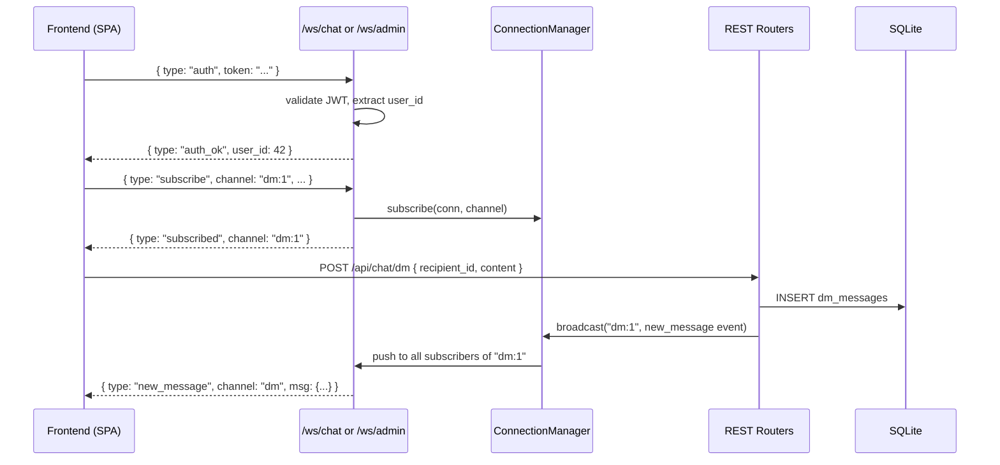

# WebSocket + AI Chat Fixes — Implementation Plan

## Architecture Overview



---

## Phase A: WebSocket Backend

### A1. Create `app/ws_manager.py`

New file. Contains a singleton `ConnectionManager` class:

```
class ConnectionManager:
    - active_connections: dict[int, WebSocket]  (user_id → ws)
    - subscriptions: dict[str, set[int]]        (channel → set of user_ids)

    async def connect(websocket, user_id) → stores in active_connections
    def disconnect(user_id) → removes from active_connections + all subscriptions
    def subscribe(user_id, channel) → adds user_id to subscriptions[channel]
    def unsubscribe(user_id, channel) → removes from subscriptions[channel]
    async def send_to_user(user_id, data) → sends JSON to that user's websocket
    async def broadcast(channel, data) → sends to all subscribed users on that channel
    def get_subscriptions(user_id) → returns list of channels that user is subscribed to
```

Two module-level singletons:
- `chat_manager = ConnectionManager()` — for `/ws/chat`
- `admin_manager = ConnectionManager()` — for `/ws/admin`

### A2. Add `/ws/chat` endpoint in `app/main.py`

```
@app.websocket("/ws/chat")
async def ws_chat(websocket: WebSocket):
    await websocket.accept()
    user_id = None
    try:
        while True:
            raw = await websocket.receive_text()
            msg = json.loads(raw)
            msg_type = msg.get("type")

            if msg_type == "auth":
                token = msg.get("token", "")
                payload = decode_jwt(token, get_settings()["SECRET_KEY"])
                if not payload:
                    await websocket.send_json({"type": "auth_error", "detail": "Invalid token"})
                    await websocket.close()
                    return
                user_id = int(payload.get("sub"))
                # Verify user exists in DB
                async with aiosqlite.connect(DB_PATH) as db:
                    db.row_factory = aiosqlite.Row
                    cur = await db.execute("SELECT id FROM users WHERE id = ?", (user_id,))
                    if not await cur.fetchone():
                        await websocket.send_json({"type": "auth_error", "detail": "User not found"})
                        await websocket.close()
                        return
                    # Check token_version
                    cur = await db.execute("SELECT token_version FROM users WHERE id = ?", (user_id,))
                    row = await cur.fetchone()
                    token_version = row["token_version"] if row else 0
                    payload_version = payload.get("tv", 0)
                    if payload_version != token_version:
                        await websocket.send_json({"type": "auth_error", "detail": "Token revoked"})
                        await websocket.close()
                        return

                await chat_manager.connect(websocket, user_id)
                await websocket.send_json({"type": "auth_ok", "user_id": user_id})

            elif msg_type == "subscribe":
                channel = msg.get("channel")
                await chat_manager.subscribe(user_id, channel)
                await websocket.send_json({"type": "subscribed", "channel": channel})

            elif msg_type == "unsubscribe":
                channel = msg.get("channel")
                chat_manager.unsubscribe(user_id, channel)
                await websocket.send_json({"type": "unsubscribed", "channel": channel})

            elif msg_type == "message":
                # Route message to appropriate REST endpoint internally
                channel = msg.get("channel")
                conversation_id = msg.get("conversation_id")
                content = msg.get("content", "")
                # This would call the internal logic; we handle it differently — 
                # messages go through REST, WS is for receiving only
                pass

    except WebSocketDisconnect:
        if user_id is not None:
            chat_manager.disconnect(user_id)
    except Exception:
        if user_id is not None:
            chat_manager.disconnect(user_id)
```

Key design decisions:
- Auth happens via first message (not headers), because browser WebSocket API doesn't support custom headers
- After auth, channels like `dm:1`, `group:5`, `global` are subscribed to
- Messages are still sent via REST POST (not via WebSocket), to keep the REST API as the authoritative write path. The routers then call `chat_manager.broadcast()` to push to subscribers.

### A3. Add `/ws/admin` endpoint in `app/main.py`

Same pattern as A2 but uses `admin_manager` singleton. Channels: `users`, `logs`, `tokens`.

### A4. Modify `app/routers/chat_router.py` — Broadcast on send

At the top of the file, import the manager:
```python
from app.ws_manager import chat_manager
```

Modify these functions to broadcast after successful DB write:

- **`dm_send`** (line 196): After `return dict(await cursor.fetchone())`, add:
  ```python
  msg_dict = dict(await cursor.fetchone())
  # Broadcast to both sender and recipient's DM channel
  channel_key = f"dm:{min(user['id'], body.recipient_id)}_{max(user['id'], body.recipient_id)}"
  await chat_manager.broadcast(channel_key, {"type": "new_message", "channel": "dm", "conversation_id": body.recipient_id, "msg": msg_dict})
  ```

  Wait — looking at how DMs are loaded, the contact selection uses `dmActiveContact.user_id`. The frontend subscribes to `dm:5` where 5 is the other user's id. So channel should be `dm:{other_user_id}` from the subscriber's perspective. Better approach: broadcast to both users' individual DM channels.

  Actually, let's use a simple convention: channel `dm:{user_id}` means "DMs involving user_id". When a DM is sent between user A and user B:
  - broadcast to `dm:{A}` with msg + `{"other_user_id": B}`
  - broadcast to `dm:{B}` with msg + `{"other_user_id": A}`
  
  Each user subscribes to `dm:{their_own_id}` to receive all their DMs.

- **`group_send_message`** (line 454): After return:
  ```python
  msg_dict = dict(await cursor.fetchone())
  await chat_manager.broadcast(f"group:{group_id}", {"type": "new_message", "channel": "group", "conversation_id": group_id, "msg": msg_dict})
  ```

- **`global_send_message`** (line 754): After return:
  ```python
  msg_dict = dict(await cursor.fetchone())
  await chat_manager.broadcast("global", {"type": "new_message", "channel": "global", "msg": msg_dict})
  ```

### A5. Modify `app/routers/admin_router.py` — Broadcast on data changes

Import:
```python
from app.ws_manager import admin_manager
```

Add broadcasts after these state-changing operations:
- `admin_create_user` (line 353): `await admin_manager.broadcast("users", {"type": "data_changed", "channel": "users"})`
- `admin_update_user` (line 259): same
- `delete_user` (line 529): same
- `toggle_lock` (line 397): same
- `change_role` (line 432): same
- `reorder_users` (line 209): same
- `update_settings` (line 490): same (plus `"tokens"` if jwt_expiry changes)
- `revoke_user_token` (line 570): `await admin_manager.broadcast("tokens", {"type": "data_changed", "channel": "tokens"})`
- `revoke_all_tokens` (line 585): same
- `clear_logs` (line 319): `await admin_manager.broadcast("logs", {"type": "data_changed", "channel": "logs"})`

### A6. Modify `app/models.py` — Add `reasoning` field

Add to `AIChatRequest`:
```python
reasoning: Optional[bool] = False
```

### A7. Modify `app/routers/ai_router.py` — Reasoning support

In the SSE generator (line ~1739), modify the request body to include `reasoning: true` when the client requests it:
```python
json_body = {
    "model": model_name,
    "messages": upstream_messages,
    "stream": True,
}
if body.reasoning:
    json_body["reasoning"] = True
```

In the SSE streaming loop (line ~1754), handle `reasoning_content` in the delta alongside `content`:
```python
delta = choices[0].get("delta", {})
content = delta.get("content", "")
reasoning = delta.get("reasoning_content", "")
if reasoning:
    full_content += f"[Reasoning: {reasoning}]\n"
if content:
    full_content += content
```

The frontend will display reasoning steps differently (e.g., in a collapsible block).

### A8. Update `requirements.txt`

No changes needed — `websockets` is already a dependency of `uvicorn` (which depends on `websockets`). FastAPI's `WebSocket` class works out of the box with `uvicorn`.

If the app runs with `uvicorn app.main:app`, WebSocket support is automatic. No new pip packages needed.

---

## Phase B: Frontend WebSocket Integration

### B1. Add WebSocket connection function

Add to the global scope (near the chat state variables):

```javascript
let chatWS = null;       // WebSocket for /ws/chat
let adminWS = null;      // WebSocket for /ws/admin
let wsReconnectTimer = null;

function connectChatWS() {
    if (chatWS && chatWS.readyState === WebSocket.OPEN) return;
    const token = getToken();
    if (!token) return;
    
    const protocol = location.protocol === 'https:' ? 'wss:' : 'ws:';
    chatWS = new WebSocket(protocol + '//' + location.host + '/ws/chat');
    
    chatWS.onopen = () => {
        chatWS.send(JSON.stringify({ type: 'auth', token: token }));
    };
    
    chatWS.onmessage = (event) => {
        const msg = JSON.parse(event.data);
        if (msg.type === 'auth_ok') {
            // Subscribe to channels based on current active tab
            if (chatActiveTab === 'dm' && dmActiveContact) {
                chatWS.send(JSON.stringify({ type: 'subscribe', channel: 'dm:' + dmActiveContact.user_id }));
            }
            if (chatActiveTab === 'group' && groupActiveGroup) {
                chatWS.send(JSON.stringify({ type: 'subscribe', channel: 'group:' + groupActiveGroup.id }));
            }
            if (chatActiveTab === 'global') {
                chatWS.send(JSON.stringify({ type: 'subscribe', channel: 'global' }));
            }
        } else if (msg.type === 'new_message') {
            handleWSMessage(msg);
        } else if (msg.type === 'auth_error') {
            console.error('[WS Chat] Auth error:', msg.detail);
        }
    };
    
    chatWS.onclose = () => {
        chatWS = null;
        // Reconnect after 5 seconds if chat panel is still open
        if (chatPanelExpanded) {
            wsReconnectTimer = setTimeout(connectChatWS, 5000);
        }
    };
    
    chatWS.onerror = (err) => {
        console.error('[WS Chat] Error:', err);
    };
}

function handleWSMessage(msg) {
    if (msg.channel === 'dm') {
        // Only process if we're viewing this DM
        if (dmActiveContact && msg.msg && 
            (msg.msg.sender_id === dmActiveContact.user_id || msg.msg.recipient_id === dmActiveContact.user_id)) {
            // Append to dmMessages if not already present
            const existingIds = new Set(dmMessages.map(m => m.id));
            if (!existingIds.has(msg.msg.id)) {
                dmMessages.push(msg.msg);
                updateChatPanel();
                scrollDMBottom();
            }
        }
        // Refresh contacts list
        loadDMContacts();
    } else if (msg.channel === 'group') {
        if (groupActiveGroup && groupActiveGroup.id === msg.conversation_id) {
            const existingIds = new Set(groupMessages.map(m => m.id));
            if (!existingIds.has(msg.msg.id)) {
                groupMessages.push(msg.msg);
                updateChatPanel();
                scrollGroupBottom();
            }
        }
    } else if (msg.channel === 'global') {
        const existingIds = new Set(globalMessages.map(m => m.id));
        if (!existingIds.has(msg.msg.id)) {
            globalMessages.push(msg.msg);
            updateChatPanel();
            scrollGlobalBottom();
        }
    }
}
```

### B2. Integrate WebSocket into chat tab switching

Modify `setChatTab()`:

```javascript
function setChatTab(tab) {
    chatActiveTab = tab;
    
    // Connect WebSocket if not already
    connectChatWS();
    
    if (tab === 'ai') {
        loadAvailableEndpoints();
        loadChatSessions();  // ← was missing; needed for auto-load
    }
    if (tab === 'dm') {
        dmActiveContact = null; dmMessages = [];
        loadDMContacts();
        // Subscribe to own DM channel
        if (chatWS && chatWS.readyState === WebSocket.OPEN) {
            const decoded = decodeToken(getToken());
            const uid = decoded ? parseInt(decoded.sub) : null;
            if (uid) chatWS.send(JSON.stringify({ type: 'subscribe', channel: 'dm:' + uid }));
        }
    }
    if (tab === 'group') {
        groupActiveGroup = null; groupMessages = [];
        loadGroups();
    }
    if (tab === 'global') {
        globalMessages = [];
        loadGlobalMessages();
        // Subscribe to global
        if (chatWS && chatWS.readyState === WebSocket.OPEN) {
            chatWS.send(JSON.stringify({ type: 'subscribe', channel: 'global' }));
        }
    }
    updateChatPanel();
}
```

### B3. Remove polling, replace with WebSocket subscription

**`startDMPolling`** → Remove entirely. When a DM contact is opened, subscribe to the WS channel instead.

In the DM contact click handler (where `startDMPolling(userId)` is called), replace with:
```javascript
// Subscribe via WebSocket
if (chatWS && chatWS.readyState === WebSocket.OPEN) {
    chatWS.send(JSON.stringify({ type: 'subscribe', channel: 'dm:' + userId }));
}
```

**`startGroupPolling`** → Remove entirely. When a group is opened, subscribe:
```javascript
if (chatWS && chatWS.readyState === WebSocket.OPEN) {
    chatWS.send(JSON.stringify({ type: 'subscribe', channel: 'group:' + groupId }));
}
```

**Global polling timer** → Remove the `setInterval` in `loadGlobalMessages` (lines 10210-10214). Keep the initial `loadGlobalMessages()` call for loading history. Real-time updates come via WS.

### B4. Admin panel WebSocket

Add a `connectAdminWS()` function following the same pattern:
```javascript
function connectAdminWS() {
    if (adminWS && adminWS.readyState === WebSocket.OPEN) return;
    const token = getToken();
    if (!token) return;
    
    const protocol = location.protocol === 'https:' ? 'wss:' : 'ws:';
    adminWS = new WebSocket(protocol + '//' + location.host + '/ws/admin');
    
    adminWS.onopen = () => {
        adminWS.send(JSON.stringify({ type: 'auth', token: token }));
    };
    
    adminWS.onmessage = (event) => {
        const msg = JSON.parse(event.data);
        if (msg.type === 'auth_ok') {
            // Subscribe to all admin channels
            adminWS.send(JSON.stringify({ type: 'subscribe', channel: 'users' }));
            adminWS.send(JSON.stringify({ type: 'subscribe', channel: 'logs' }));
            adminWS.send(JSON.stringify({ type: 'subscribe', channel: 'tokens' }));
        } else if (msg.type === 'data_changed') {
            // Refresh relevant data
            if (msg.channel === 'users') {
                // Trigger user list refresh if admin panel is open
                if (typeof loadAdminUsers === 'function') loadAdminUsers();
            } else if (msg.channel === 'logs') {
                if (typeof loadAdminLogs === 'function') loadAdminLogs();
            } else if (msg.channel === 'tokens') {
                if (typeof loadAdminTokens === 'function') loadAdminTokens();
            }
        }
    };
    
    adminWS.onclose = () => { adminWS = null; };
    adminWS.onerror = (err) => { console.error('[WS Admin] Error:', err); };
}
```

Call `connectAdminWS()` when the admin panel is first rendered (in the admin panel rendering function).

### B5. Clean up on chat panel close

Modify the close function (where `closeChatPanel` is) to also close WS:
```javascript
function closeChatPanel() {
    chatPanelExpanded = false;
    if (chatWS) { chatWS.close(); chatWS = null; }
    if (wsReconnectTimer) { clearTimeout(wsReconnectTimer); wsReconnectTimer = null; }
    // Clear polling timers if any still exist (transitional)
    if (dmPollTimer) { clearInterval(dmPollTimer); dmPollTimer = null; }
    if (groupPollTimer) { clearInterval(groupPollTimer); groupPollTimer = null; }
    if (globalPollTimer) { clearInterval(globalPollTimer); globalPollTimer = null; }
    updateChatPanel();
}
```

---

## Phase C: AI Chat Fixes

### C1. Auto-load most recent session on AI tab open

Modify `setChatTab('ai')` and `loadChatSessions()`:

In `loadChatSessions()`, after fetching sessions, auto-select the most recent if no session is active:
```javascript
function loadChatSessions() {
    apiGet('/api/ai/sessions')
        .then(data => {
            chatSessions = data.sessions || data;
            // Auto-select most recent session if none is active
            if (!chatCurrentSessionId && chatSessions.length > 0) {
                chatCurrentSessionId = chatSessions[0].id;
                loadChatSession(chatSessions[0].id);
                return; // loadChatSession will call updateChatPanel
            }
            updateChatPanel();
        })
        .catch(err => { console.error('[Chat] Failed to load chat sessions:', err); });
}
```

Also, call `loadChatSessions()` inside `setChatTab('ai')`:
```javascript
if (tab === 'ai') {
    loadAvailableEndpoints();
    loadChatSessions();  // ← ADD THIS
}
```

### C2. Fix endpoint label in dropdown

Current (line 9436):
```javascript
ep.name + (ep.source ? ' (' + ep.source + ')' : '')
```

Fix: Show just `ep.name`, since `ep.source` is already the `<optgroup>` label:
```javascript
ep.name
```

The source grouping via `groupEndpoints()` already provides visual grouping through `<optgroup label="...">`. The redundant text in the option itself is visual noise.

### C3. Add reasoning checkbox

Add new state variable near other chat state variables (around line ~9300 in the variable declarations):
```javascript
let chatReasoningEnabled = false;
```

In `renderAIChatTab()`, add a row below the session bar (after line ~9422, before the endpoint selector):
```javascript
// Reasoning toggle row
el('div', { className: 'chat-session-row', style: { justifyContent: 'flex-start', gap: '6px' } },
    el('label', { style: { display: 'flex', alignItems: 'center', gap: '4px', fontSize: '12px', cursor: 'pointer' } },
        el('input', { type: 'checkbox', checked: chatReasoningEnabled ? 'checked' : null, onchange: (e) => {
            chatReasoningEnabled = e.target.checked;
            updateChatPanel();
        } }),
        'Reasoning',
    ),
),
```

In `handleAIChatSend()`, add `reasoning` to the request body:
```javascript
const body = {
    message: message,
    endpoint_id: chatSelectedEndpointId,
    model_name: chatSelectedModel,
    context_selection: chatContextSelection,
    reasoning: chatReasoningEnabled,  // ← ADD
};
```

### C4. Handle reasoning_content in SSE stream

In the SSE stream handler (inside `handleAIChatSend()`, around line 9725), after the existing delta.content handling, add:
```javascript
if (delta && delta.reasoning_content) {
    const lastMsg = chatMessages[chatMessages.length - 1];
    if (lastMsg && lastMsg.role === 'assistant') {
        // Store reasoning in a separate field or prefix it
        if (!lastMsg.reasoning) lastMsg.reasoning = '';
        lastMsg.reasoning += delta.reasoning_content;
    }
}
```

In `renderChatMessageBubble()`, if `msg.reasoning` exists, render it as a collapsible block:
```javascript
// Inside the message bubble rendering, after the content
...(msg.reasoning ? [
    el('details', { style: { marginTop: '4px', fontSize: '11px' } },
        el('summary', { style: { cursor: 'pointer', color: 'var(--text-muted)' } }, 'Reasoning'),
        el('pre', { style: { whiteSpace: 'pre-wrap', color: 'var(--text-muted)', margin: '4px 0', padding: '4px 8px', background: 'var(--bg-hover)', borderRadius: '4px' } }, msg.reasoning),
    ),
] : []),
```

### C5. Add progress status indicator

Add a new state variable:
```javascript
let chatStatus = 'ready'; // 'ready', 'connecting', 'receiving'
```

In `renderAIChatTab()`, add a status bar below the session bar section (between the session bar and context selector, around line 9462):
```javascript
// Progress status indicator
el('div', { className: 'chat-status-bar', id: 'chat-status-bar' },
    el('span', { className: 'chat-status-text' },
        chatStatus === 'ready' ? 'Ready' :
        chatStatus === 'connecting' ? 'Connecting...' :
        chatStatus === 'receiving' ? 'Receiving...' :
        'Ready'
    ),
),
```

Add CSS (in the `<style>` section):
```css
.chat-status-bar {
    padding: 2px 8px;
    font-size: 11px;
    color: var(--text-muted);
    background: var(--bg-secondary);
    border-bottom: 1px solid var(--border-light);
    text-align: center;
}
```

In `handleAIChatSend()`:
- Set `chatStatus = 'connecting'` before the fetch call
- Set `chatStatus = 'receiving'` when the first chunk arrives
- Set `chatStatus = 'ready'` in the finally block

---

## Phase D: Create Configuration Button Fix

### D1. Check disabled logic

Looking at `showCreateConfigForm` (line 5331), the button at line 5363:
```javascript
el('button', { className: 'btn btn-primary', disabled: formSubmitting || !formName.trim() ? 'disabled' : null, ... })
```

This is correct: disabled when submitting OR when name is empty. No fix needed — the logic is valid after the form simplification.

The caller at line 5183 (`onclick: () => showCreateConfigForm(ep, loadDetailConfigs)`) passes the callback correctly.

**No changes needed for Phase D.**

---

## Summary of All Files to Modify/Create

| File | Action | Description |
|---|---|---|
| `app/ws_manager.py` | **CREATE** | ConnectionManager class + chat_manager & admin_manager singletons |
| `app/main.py` | MODIFY | Add `/ws/chat` and `/ws/admin` WebSocket endpoints |
| `app/routers/chat_router.py` | MODIFY | Import chat_manager, broadcast after dm_send, group_send_message, global_send_message |
| `app/routers/admin_router.py` | MODIFY | Import admin_manager, broadcast after state-changing operations |
| `app/models.py` | MODIFY | Add `reasoning: Optional[bool] = False` to AIChatRequest |
| `app/routers/ai_router.py` | MODIFY | Add reasoning to upstream request body; handle reasoning_content in SSE stream |
| `static/index.html` | MODIFY | Add WebSocket functions, replace polling, add reasoning checkbox/display, add status indicator, fix endpoint label, auto-load session |
| `requirements.txt` | NO CHANGE | `websockets` is already a transitive dependency via uvicorn |

---

## Implementation Order

1. **`app/ws_manager.py`** — ConnectionManager (no deps)
2. **`app/models.py`** — Add reasoning field
3. **`app/routers/chat_router.py`** — Add broadcast calls (depends on ws_manager)
4. **`app/routers/admin_router.py`** — Add broadcast calls (depends on ws_manager)
5. **`app/routers/ai_router.py`** — Add reasoning support
6. **`app/main.py`** — Add WebSocket endpoints (depends on ws_manager)
7. **`static/index.html`** — All frontend changes (can be done in parallel with backend)
